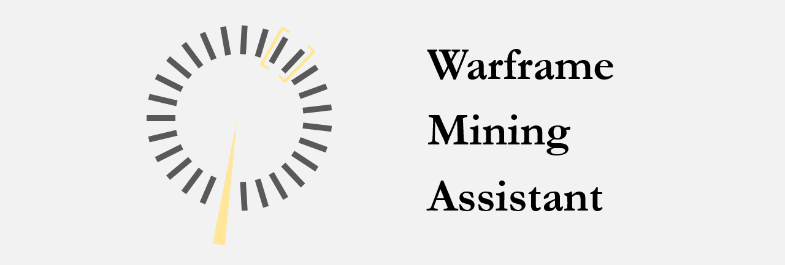

**Semi**-automated [mining](https://warframe.fandom.com/wiki/Mining) assistant for the video game [Warframe](https://en.wikipedia.org/wiki/Warframe), which aims at stopping the mining process (i.e., releasing`LMB`) at the most accurate timing.

> **Note:** use of any unauthorized third-party tool in Warframe could be considered as a **violation of [EULA(2.f.)](https://www.warframe.com/eula)**.

## Demo ([demo gif](https://github.com/EricZhu-42/Warframe-MiningAssistant/blob/main/misc/example.gif))


## How it works ? ([illustrative png](https://github.com/EricZhu-42/Warframe-MiningAssistant/blob/main/misc/framework.png))


## Dependencies

- **Python:** 3.7.11 or higher
- **libraries:** `opencv-python`, `imutils`, `numpy`, `mss`, `pynput`
- **monitor resolution:** only tested with **2560x1440**; the code (in theory) supports any **16:9 resolution**

## Usage

```bash
python main.py [-h] [-s]
```

